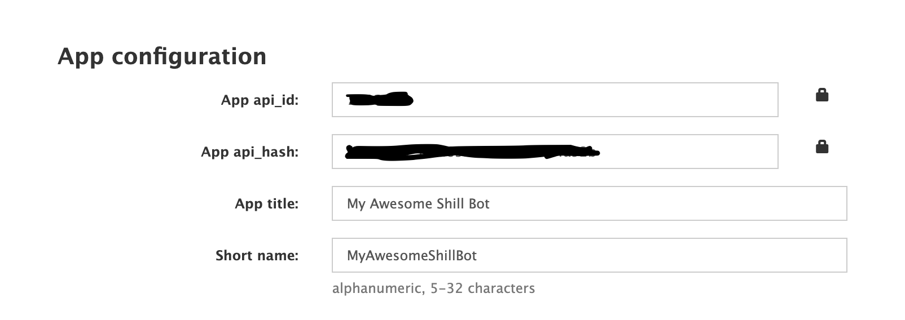
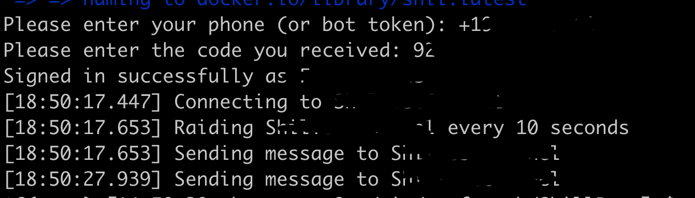
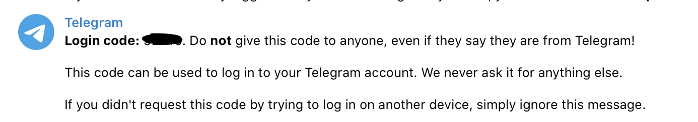

# Telegram Shill Bot
Ever wanted a Shill Bot but wankers keep scamming for one OR wanted to charge you an arm and a leg?

This is a simple bot written in Python that you can use to shill (i.e. send messages) your token, or whatever, to Telegram channels.

There are a couple of runtime options available (one easy, one hard), so please read the entire doc. The `easy` runtime will most likely work (but not tested) on Windows, since it is ran via a Docker container.

## Speaking Of Shilling
If you find this bot useful, please consider donating any token of value to our BSC wallet:
`0xb973B103c83E467f27D04e9F31F70aaf1A83d595`. Just as an example, some paid shill bots cost **~$500.00**, with few additional features.

## <span style="color:red">WARNING</span> ##
This can cause your account to be rate limited and even banned if you shill too often. A safe `wait_interval` is typically around 900 seconds.

## ToC
* [Download](#download)
* [Setup](#setup)
* [Running](#running)
  + [Easy](#easy)
  + [Not As Easy](#not-as-easy)
  + [Telegram Prompt](#telegram-prompt)
* [Stopping](#stopping)
* [Tested With](#tested-with)
* [Contribute](#contribute)
* [FAQ](#faq)
* [ToDo](#todo)

## Download
- Download the code
  - **DEVELOPER:** You can `git clone` the repo
    ```bash
    git clone git@github.com:surfranch/TelegramShillBot.git
    ```
  - **NON-DEVELOPER:** You can download the ZIP archive
    - https://github.com/surfranch/TelegramShillBot/archive/refs/heads/main.zip
    - Save it to a path you will be able to easily navigate to
      - For example:
        ```bash
        # Mac
        /Users/yourusername/shillbot

        # Windows
        C:\shillbot

        # Linux
        /opt/shillbot
        ```
- Open a `terminal` and navigate to the downloaded code
  - For example:
    ```bash
    # Mac
    cd /Users/yourusername/shillbot

    # Windows
    cd C:\shillbot

    # Linux
    cd /opt/shillbot
    ```
  - For our non-developer friends, if you have no/little experience with a `terminal`, one of these video tutorials should help
    - Mac: https://www.youtube.com/watch?v=aKRYQsKR46I
    - Windows: https://www.youtube.com/watch?v=MBBWVgE0ewk

## Setup
- Obtain a Telegram API ID
  - https://core.telegram.org/api/obtaining_api_id

- Grab your `api_id`, `api_hash`, and app `short name`
  - https://my.telegram.org/apps
  

- Create a copy of the file `settings.example.yml` in the same directory and name it `settings.yml`

- If this is your 1st time editing a YAML file, we strongly recommend taking 15 minutes to learn about it here: https://gettaurus.org/docs/YAMLTutorial/

- Fill out the `settings.yml` with your app configuration details
  - **BEFORE**
    ```yaml
    ---

    api_id: API_ID
    api_hash: API_HASH
    app_short_name: APP_SHORT_NAME
    phone_number: "PHONE_NUMBER"

    splay: 7
    ...
    ```
  - **AFTER**
    ```yaml
    ---

    api_id: 123456
    api_hash: abc123xyz456
    app_short_name: MyAwesomeShillBot
    phone_number: "+18888675309"
    # ^^ make sure phone number is in quotes

    splay: 7
    # ^^ when connecting to many (10+) channels, this should be increased
    ...
    ```

- Fill out the `settings.yml` with the message(s) you want to shill
  - **BEFORE**
    ```yaml
    ...
    messages:
      one: |
        this is message 1
        it can be whatever you want it to be
      two: |
        this is message 2
        again, it can be whatever you want it to be
        so you can have some variation
    ...
    ```
  - **AFTER**
    ```yaml
    ...
    messsages:
      one: |
        i will be whatever you define me to be
      two: |
        and so will i
      three: |
        i am yet another message
      # ^^ you can add as many messages as you want as long as the prescribed format is followed
    ...
    ```

- Fill out the `settings.yml` with the channel(s) you want to shill, and how you want to shill them (i.e. what message you would like to send)
  - Please make sure you are using the official Telegram channel name and not what is shown in the channel title
    - e.g. The official Telegram channel name for `https://t.me/TelegramTips` is `TelegramTips`, even though the channel title is `Telegram Tips`
    - This can be obtained by viewing the channel info
  - **BEFORE**
    ```yaml
    ...
    raid:
      CHANNEL_NAME:
        message_type: one
        wait_interval: 3
      SOME_OTHER_CHANNEL_NAME:
        message_type: two
        wait_interval: 300
    ```
  - **AFTER**
    ```yaml
    ...
    raid:
      cryptoblank:
        message_type: one
        # ^^ this maps to a message "name" you created earlier
        wait_interval: 1800
        # ^^ this is in seconds
      tsamoon:
        message_type: two
        wait_interval: 900
      shiltestchannel01:
        message_type: three
        wait_interval: 60
      # ^^ you can add as many channels as you want as long as the prescribed format is followed
      iamnotreal:
        message_type: three
      # ^^ you don't have to declare a wait interval, the channel will only be raided once
      iamalsonotreal:
        message_type: three
        wait_interval: 300
        increase_wait_interval: 60
        # ^^ you can choose to increase the channel's wait interval after every iteration
      ibfake:
        message_type: three
        image: images/awhsum.jpg
        # ^^ you can choose to send an image with the message
      isendmany:
        message_type:
        - one
        - two
        - three
        # ^^ you can choose to send multiple message types
        wait_interval: 900
        image: images/awhsum.jpg
      iwillstop:
        message_type: three
        wait_interval: 900
        total_messages: 50
        # ^^ you can choose to limit how many messages are sent to a channel
    ```

- Verify your YAML by copying the contents of `settings.yml` and paste it into http://www.yamllint.com/
  - Fix any reported errors

- Sign into the Telegram channels you plan to shill, using the account you plan to shill with
  - This should fix any `CAPTCHA` guards that may be in place

## Running
### Easy
- Install Docker
  - https://docs.docker.com/engine/install/
#### From Your Terminal
**NOTE:** Assumes you have navigated to the same directory as the downloaded code
- **Linux/Mac users:** run the Docker bot script
  ```bash
  ./build_n_run.sh
  ```
- **Windows users:** run the Docker commands
  ```bash
  docker image build -t shil:latest .
  docker container run -it --rm shil
  ```

### Not As Easy
- Install Python v3
  - v3.10 is the preferred (tested) version
  - v3.5 - v3.9 *should* work
  - **Mac:** https://docs.python-guide.org/starting/install3/osx/
  - **Windows:** https://phoenixnap.com/kb/how-to-install-python-3-windows
  - **Linux:** https://docs.python-guide.org/starting/install3/linux/
- Verify your Python version is v3.5 or greater
  ```bash
  python3 --version
  Python 3.10.0
  ```

#### From Your Terminal
**NOTE:** Assumes you have navigated to the same directory as the downloaded code
- Install Python packages
  ```bash
  pip3 install -r requirements.txt
  ```
- Run the bot
  - ```bash
    python3 tg_shill_bot.py
    ```

### Telegram Prompt
You will be prompted to enter your phone (or bot token) and the Telegram code you received - please fill it out.
- **NOTE:** We have not heard of anyone successfully using a bot token; you will most likely have to use your phone



## Stopping
- Whether running in Docker or locally, `Ctrl+C` should stop the process

## Tested With
- `macOS Monterey v12.1`
- ```bash
  $ python --version
  Python 3.10.0
  $ pip --version
  pip 21.2.3 from ... (python 3.10)
  ```
- 5 unique Telegram channels
- 5 unique messages
- JPG images

## Contribute
- We welcome any contribution to the project (issues and PRs)
- If you have any code to contribute, please follow the fork, branch, PR process

## FAQ
**- Does the bot still work ??**

As of 3/15/2022, yes !! We know of people running it on Mac, Windows, and Linux ..

**- Can I use multiple accounts on a single bot ??**

No .. But -- there is nothing stopping you from running multiple bots, each using a different account, on your machine ..

**- Why are there random "thank yous" appended to every message ??**

When you send identical messages, multiple times to multiple channels, Telegram will ban you .. In an effort to avoid this ban, we have decided to append random "thank yous" to every message sent, and it appears to work ..

*NOTE:* you have the ability to modify the words used to generate the random message, and its presented format, via the `settings.yml` file .. We recommend only the most skilled users even attempt this ..

**- Why am I getting a FloodWaitError ??**

This primarily occurs when: 1) you are attempting to connect to "many" channels, and 2) you are sending messages "frequently" .. We recommend starting with 10 channels and sending messages every 900 seconds .. Based on your results, you can increase/decrease from there ..

**- Why am I getting banned ??**

*User invoked ban ::* this is when a user has banned you from a channel, for whatever reason .. There is nothing we can do here ..

*Telegram invoked ban ::* this is when Telegram has banned your account, most likely for sending identical messages, multiple times to multiple channels (see FAQ about random "thank yous" above) .. To unban, this [LINK](https://whatareview.com/how-to-fix-recover-telegram-this-phone-number-is-banned/) seems to work ..

## ToDo
- Solve join captchas:
  - Rose simple button click: Can use simple telethon
  - Alphabet captchas: Can use some optical character recognition
  - Sum of integers or logical operations: OCR, identify operator and perform the logic
- Account rotation to not get banned or rate limited ...
- UI maybe if we want to get fancy with this
  - Or use existing tg clients with something like pyautogui

##### Keywords
bot
shill, shillbot, shill bot
telegram, telegram shill, telegram shillbot, telegram shill bot
